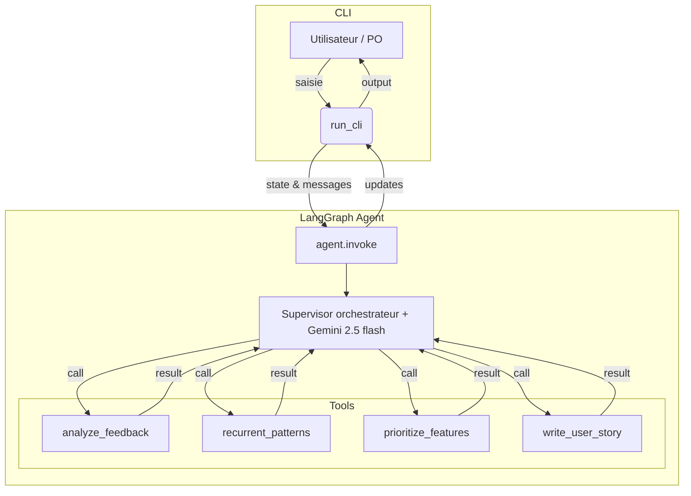

# langchain-po-agent
Agent IA basé sur LangChain qui aide les Product Owners à analyser les retours utilisateurs, appliquer des frameworks de priorisation (RICE, MoSCoW) et générer des user stories complètes.

# Product Owner copilot
## Consignes

Consultez les [consignes du projet](CONSIGNES.md) pour plus de détails sur les fonctionnalités attendues, les livrables et les critères d'évaluation.


## Objectif

L'objectif de ce projet est de construire un agent IA intelligent qui agit comme un **copilote pour le Product Owner**. Il vise à automatiser les tâches répétitives et à fournir une aide à la décision pour gérer efficacement un backlog produit.

Les trois piliers fonctionnels sont :

1.  **Analyse de feedback :** Traitement de données brutes (emails, tickets) pour en extraire des demandes de fonctionnalités, des bugs et des thèmes récurrents.
2.  **Aide à la priorisation :** Application de frameworks standards (RICE, MoSCoW) pour scorer et classer les fonctionnalités de manière objective.
3.  **Rédaction assistée :** Génération de user stories structurées et de leurs critères d'acceptation.

## Architecture de la solution

La solution repose sur un **agent centralisé** qui orchestre dynamiquement l'appel à plusieurs outils spécialisés. L'agent conserve l'état de la session (historique des messages, résultats d'analyse, priorisation, user stories, etc.) tout au long de la discussion, permettant ainsi de réutiliser les résultats intermédiaires pour des requêtes ultérieures.

L'architecture suit le schéma suivant :



### Points clés :
- **Agent principal** : conserve l'état enrichi à chaque tour (features, patterns, priorisation, user stories, etc.).
- **Supervisor** : décide dynamiquement quels outils appeler selon la requête utilisateur et l'état courant.
- **Outils spécialisés** : chaque outil peut être sollicité indépendamment ou en séquence, selon la logique du LLM.
- **Historique et résultats** : tous les résultats intermédiaires sont accessibles pour les requêtes suivantes, permettant des interactions contextuelles riches.

## Feuille de route

Le projet est développé en plusieurs étapes itératives :

* **Étape 1 : Construction du noyau (MVP)**  
  * Développement **des outils spécialisés** (analyse de feedbacks, détection de patterns, priorisation, génération de user stories).  
  * Intégration de ces outils dans **l'agent principal LangGraph**.  
  * Mise à disposition d'une interface **CLI** pour exécuter et tester l'agent.

* **Étape 2 : Exposition via une API (optionnelle)**  
  * Encapsulation de la logique dans une API **FastAPI** afin de faciliter les intégrations futures.

* **Étape 3 : Interface utilisateur (optionnelle)**  
  * Création d'une UI **Streamlit** pour offrir une expérience graphique simple autour de l'agent ou de l'API.

## Structure de code et stack technique

Le projet est organisé pour séparer clairement la logique métier, les outils, la configuration et les tests. Voici l'arborescence principale du dossier backend :

```
backend/
│
├── agent/
│   ├── __init__.py
│   └── agent_main.py
│
├── core/
│   ├── __init__.py
│   └── config.py
│
├── tools/
│   ├── __init__.py
│   ├── feedback_analyzer.py
│   ├── prioritizer.py
│   └── story_writer.py
│
├── main.py
├── requirements.txt
```

**Stack technique :**
- **Langage :** Python 3.10+
- **Framework d'agent IA :** LangChain/Langgraph
- **Modèle (LLM) :** Google Gemini 2.5 Flash
- **Observabilité & débogage :** LangSmith

## Données d'essai

### Test de chaque outil séparément

- **Analyse de feedback**  
  Voici des feedbacks : « L'application plante lors de l'ajout d'un commentaire », « Je voudrais pouvoir filtrer les notifications », « Le mode nuit est agréable », « Impossible de réinitialiser mon mot de passe », « L'export CSV ne fonctionne pas sur mobile », « Merci pour la rapidité du support ». Peux-tu analyser ces feedbacks ?

- **Détection de patterns récurrents**  
  Voici des feedbacks : « La synchronisation est lente », « Je dois souvent relancer l'application », « La synchronisation échoue parfois », « L'application se fige après une mise à jour », « La synchronisation ne démarre pas automatiquement », « Je perds des données après synchronisation ». Quels sont les thèmes récurrents ?

- **Priorisation de fonctionnalités**  
  Peux-tu prioriser ces fonctionnalités selon leur valeur : « Ajout d'un calendrier partagé », « Notifications push personnalisables », « Support multi-langues », « Mode hors-ligne », « Exportation des données en JSON », « Connexion via LinkedIn » ?

- **Génération de user story**  
  Rédige une user story pour la fonctionnalité suivante : permettre à l'utilisateur de programmer l'envoi automatique de rapports hebdomadaires à son équipe.

---

### Test de tous les outils en même temps

- Voici des feedbacks : « Je veux pouvoir archiver des projets terminés », « Impossible de modifier un commentaire après publication », « L'application est lente sur tablette », « J'aimerais recevoir un résumé hebdomadaire », « Le bouton de partage ne fonctionne pas », « Merci pour la nouvelle interface ». Analyse les feedbacks, détecte les patterns, priorise les besoins et rédige une user story pour la fonctionnalité la plus importante.

---

### Test des outils un par un dans la même discussion sur le même problème

- Peux-tu analyser ces feedbacks : « Je ne peux pas inviter des membres externes », « La gestion des droits est compliquée », « Impossible de voir qui a modifié une tâche », « J'aimerais recevoir une notification quand une tâche m'est assignée », « Le système de commentaires n'est pas intuitif », « Je veux pouvoir exporter le journal d'activité » ?
- Quels patterns observes-tu dans ces retours ?
- Priorise les demandes extraites selon leur impact sur la collaboration.
- Rédige une user story pour la fonctionnalité la plus prioritaire.

---

### Test d'une tâche réalisable uniquement par le dernier outil (user story) avec des données brutes

- J'ai besoin d'une user story pour : « Ajouter une option pour dupliquer un projet existant avec toutes ses tâches, membres et paramètres », « Permettre la personnalisation des couleurs de l'interface », « Intégrer un système de vote sur les idées de fonctionnalités », « Ajouter un export automatique des rapports chaque mois », « Permettre la connexion via SSO d'entreprise », « Afficher un tutoriel interactif à la première connexion ».

## Installation et démarrage

Voici les étapes pour installer et lancer l'agent Product Owner :

1. **Cloner le dépôt**
   ```bash
   git clone https://github.com/hugop33/langchain-po-agent.git
   cd langchain-po-agent
   ```

2. **Créer un environnement virtuel**
   ```bash
   python3 -m venv .venv
   # Sur Mac/Linux
   source .venv/bin/activate
   # Sur Windows
   .venv\Scripts\activate
   ```

3. **Installer les dépendances**
   ```bash
   pip install -r backend/requirements.txt
   ```

4. **Configurer le fichier `.env`**
   - Copier le fichier d'exemple :
     ```bash
     cp backend/.env.example backend/.env
     ```
   - Ouvrir `backend/.env` et remplacer les valeurs par vos propres clés API Gemini et LangSmith si besoin.

5. **Démarrer l'agent en mode CLI**
   ```bash
   python3 -m backend.main
   ```

6. **Arrêter l'agent**
   - Appuyer sur `Ctrl+C` dans le terminal pour arrêter proprement la session CLI.

