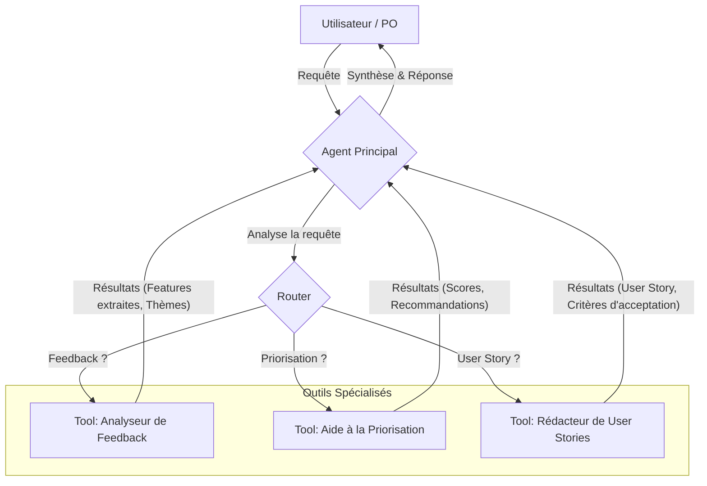

# langchain-po-agent
Agent IA basé sur LangChain qui aide les Product Owners à analyser les retours utilisateurs, appliquer des frameworks de priorisation (RICE, MoSCoW) et générer des user stories complètes.

# Product Owner copilot
## Consignes

Consultez les [consignes du projet](CONSIGNES.md) pour plus de détails sur les fonctionnalités attendues, les livrables et les critères d'évaluation.

## Objectif

L'objectif de ce projet est de construire un agent IA intelligent qui agit comme un **copilote pour le Product Owner**. Il vise à automatiser les tâches répétitives et à fournir une aide à la décision pour gérer efficacement un backlog produit.

Les trois piliers fonctionnels sont :

1.  **Analyse de feedback :** Traitement de données brutes (emails, tickets) pour en extraire des demandes de fonctionnalités, des bugs et des thèmes récurrents.
2.  **Aide à la priorisation :** Application de frameworks standards (RICE, MoSCoW) pour scorer et classer les fonctionnalités de manière objective.
3.  **Rédaction assistée :** Génération de user stories structurées et de leurs critères d'acceptation.

## Architecture de la solution

La solution est construite autour d'un **agent ReAct** qui orchestre une boîte à outils spécialisée. Cette approche modulaire garantit la robustesse et la maintenabilité du système.

## Feuille de route

Le projet est développé en plusieurs étapes itératives :

* **Étape 1 : Construction du cœur de l'agent (MVP)**
    * Un agent fonctionnel accessible en ligne de commande qui répond à toutes les exigences du test.
* **Étape 2 : Exposition via une API (Facultatif)**
    * Encapsulation de la logique dans une API FastAPI pour permettre des intégrations futures.
* **Étape 3 : Création d'une interface utilisateur (Facultatif)**
    * Développement d'une interface graphique simple avec Streamlit pour une meilleure expérience utilisateur.

## Structure de code et stack technique

Le projet sera organisé en deux répertoires principaux, backend et frontend, pour une séparation claire des préoccupations.

**Stack :**
* **Langage :** Python 3.10+
* **Framework d'agent IA :** LangChain
* **Modèle (LLM) :** Google Gemini 2.5 Flash
* **Observabilité & débogage :** LangSmith

## Données d'essai

Pour garantir la fiabilité de l'agent, un jeu de données d'essai est utilisé pour valider chaque fonctionnalité.

**Exemples de feedbacks traités :**

* **Demande de fonctionnalité claire :** `"J'aimerais vraiment pouvoir exporter mes rapports de projet au format PDF."`
* **Rapport de bug précis :** `"Impossible de me connecter via mon compte Google. La page se recharge sans rien faire."`
* **Feedback vague avec besoin implicite :** `"Je perds un temps fou à devoir recréer les mêmes types de tâches pour chaque nouveau projet."`
* **Commentaire mixte (bug + feature) :** `"Le défilement dans la vue Kanban est très saccadé sur Firefox. Au fait, ce serait génial si on pouvait attacher des fichiers directement aux tâches."`
* **Feedback positif (sans action) :** `"La dernière mise à jour de l'interface est magnifique ! Bravo à l'équipe."`

